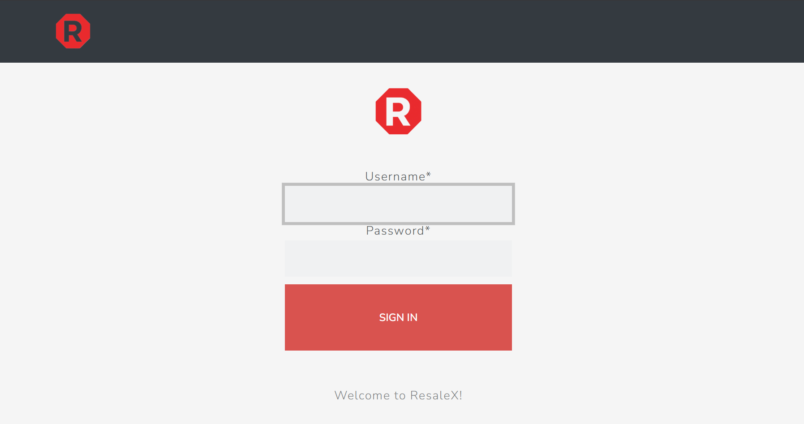
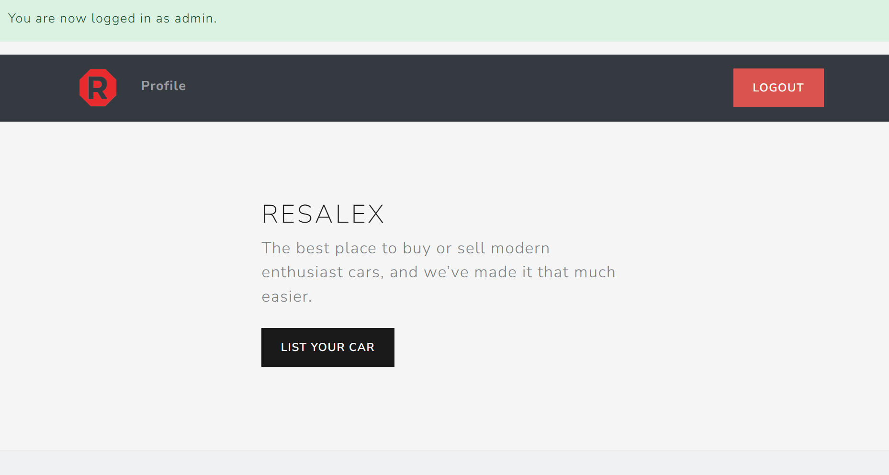
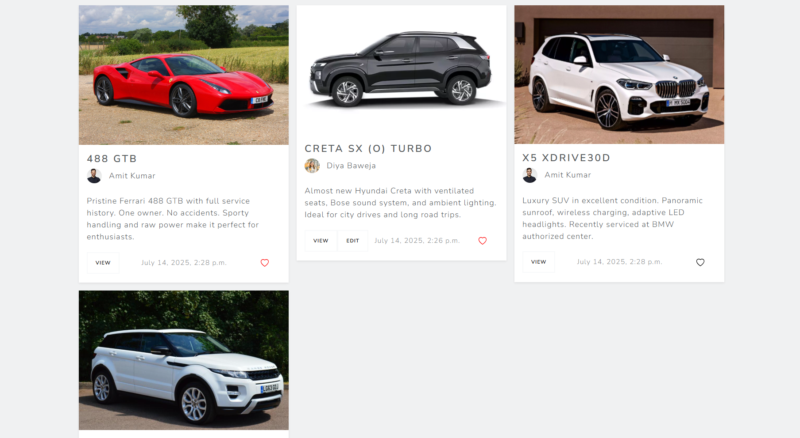
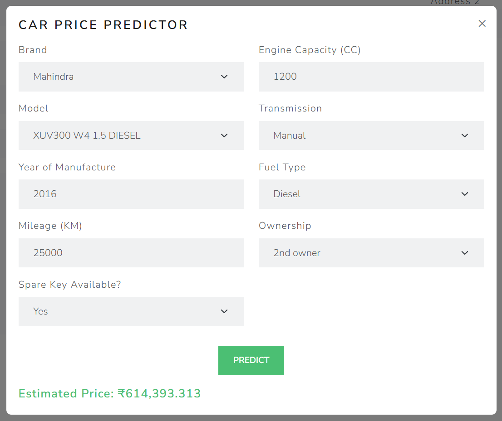

# ResaleX: AI-Powered Used Car Marketplace

ResaleX is a full-stack web application for buying and selling pre-owned cars in India. It integrates a machine learning model to predict the resale price of cars based on their specifications, helping sellers set competitive prices before posting listings.
---

## Features

- **User Authentication** – Secure signup/login for sellers and buyers.  
- **Create & Manage Listings** – Post car listings with details, location, and images.  
- **AI Price Prediction** – Predict car resale prices using a trained XGBoost model.  
- **Dynamic Filters** – Search listings by brand, model, mileage, and more.  
- **Like Listings** – Bookmark your favorite cars.  
- **Email Notifications** – Buyers can contact sellers directly via email.  
- **Responsive Design** – Mobile-first UI built with Bootstrap 5.  
<br>
<br><br>
<br><br>
<br><br>


---

## Tech Stack

- **Backend:** Django, Python  
- **Frontend:** HTML, CSS, Bootstrap, JavaScript (AJAX)  
- **Machine Learning:** XGBoost, scikit-learn, pandas, NumPy  
- **Database:** PostgreSQL (SQLite for dev)  
- **Other Tools:** Joblib (model serialization), jQuery, Django Crispy Forms  

---

## Machine Learning Model

The price prediction model was trained on a large dataset of pre-owned Indian cars:  

- Features: Brand, Model, Year, Mileage, Engine Capacity, Transmission  
- Preprocessing: Label Encoding, Target Encoding, Scaling  
- Algorithm: XGBoost Regressor  
- Achieved high accuracy with minimal overfitting.  

Artifacts saved in `main/ml/`:
```

best\_xgb.model
scaler.pkl
model\_te\_mapping.pkl
brand\_te\_mapping.pkl
onehot\_columns.pkl
global\_mean.pkl

````

---

## Getting Started

### Prerequisites
- Python 3.8+
- pipenv or virtualenv
- PostgreSQL (or SQLite)

### Installation

1. Clone the repo:
```bash
git clone https://github.com/Diya050/ResaleX.git
cd ResaleX
```

2. Create and activate virtual environment:

```bash
python -m venv venv
source venv/bin/activate  # On Windows: venv\Scripts\activate
```

3. Install dependencies:

```bash
pip install -r requirements.txt
```

4. Apply migrations and create superuser:

```bash
python manage.py makemigrations
python manage.py migrate
python manage.py createsuperuser
```

5. Start the development server:

```bash
python manage.py runserver
```

---

## Usage

* Go to `http://127.0.0.1:8000/`
* Register or login as a user.
* Create a car listing or browse existing listings.
* Use the **"Predict My Car Price"** button in the listing form to get an AI-predicted price.

---

## Acknowledgements

* [Bootstrap 5](https://getbootstrap.com/)
* [XGBoost](https://xgboost.readthedocs.io/)
* [Django](https://www.djangoproject.com/)
* Kaggle dataset: [Pre-Owned Indian Cars Dataset](https://www.kaggle.com/datasets/mrmars1010/cars-india-pre-owned)

